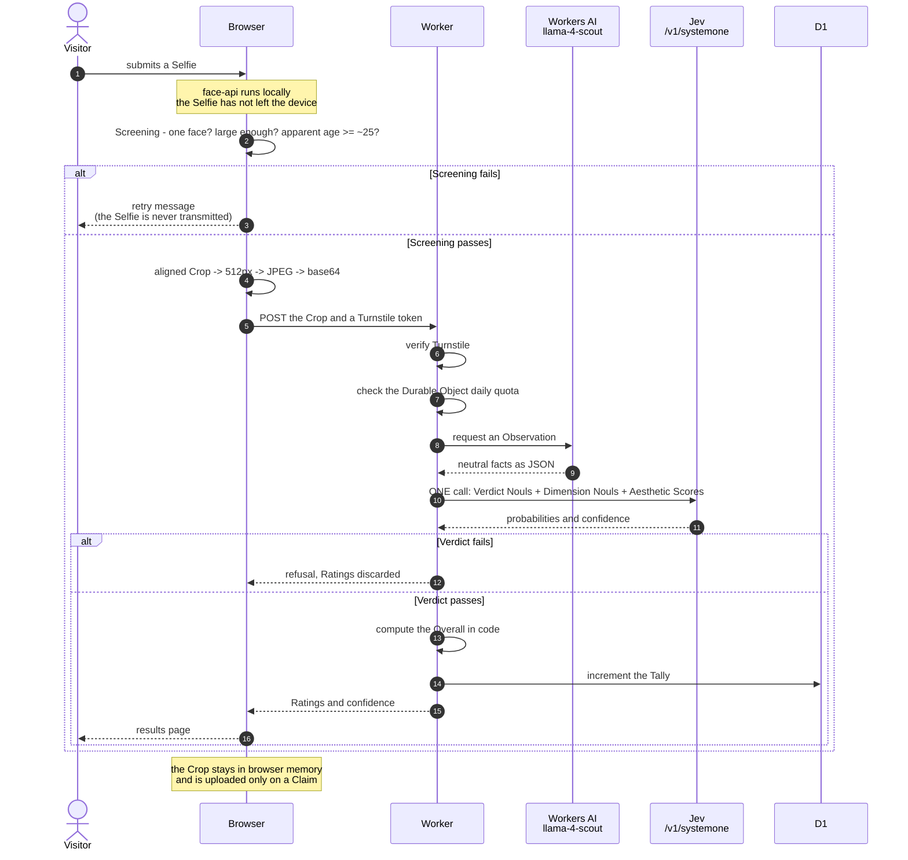
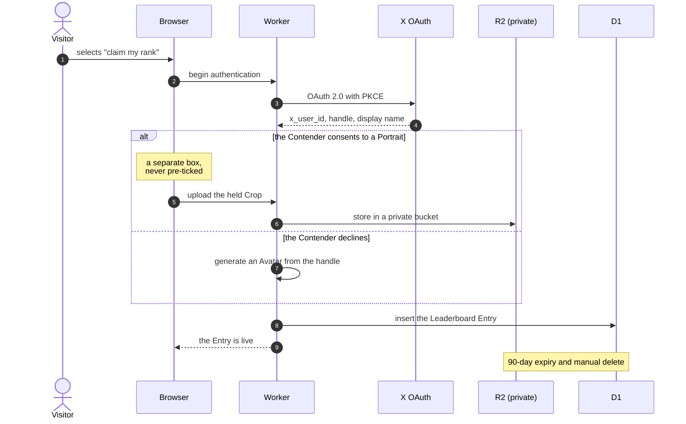

# TheFace - Design Spec

Status: agreed, not yet implemented. Date: 2026-09-18

- Vocabulary: [`CONTEXT.md`](./CONTEXT.md). This document uses those terms exactly.
- User-facing promises: [`PRIVACY.md`](./PRIVACY.md).
- Why the hard decisions were made: [`docs/adr/`](./docs/adr/).

## Contents

1. [What this is](#what-this-is)
2. [Decisions at a glance](#decisions-at-a-glance)
3. [The constraint that shapes everything](#the-constraint-that-shapes-everything)
4. [The pipeline](#the-pipeline)
5. [Diagrams](#diagrams)
6. [What gets rated](#what-gets-rated)
7. [The results page](#the-results-page)
8. [Why Screening and Verdict are ours to build](#why-screening-and-verdict-are-ours-to-build)
9. [The Leaderboard](#the-leaderboard)
10. [Portraits](#portraits)
11. [Cost](#cost)
12. [Abuse control](#abuse-control)
13. [Stack](#stack)
14. [Build checklist](#build-checklist)
15. [Constants to calibrate after launch](#constants-to-calibrate-after-launch)
16. [Open legal and vendor risks](#open-legal-and-vendor-risks)
17. [Still to decide](#still-to-decide)

## What this is

TheFace is a toy. It is a face-rating site that explores what the Jev model can do. TheFace
is not a self-improvement product.

This position permits three things: generous Overalls, a public Leaderboard, and informal
copy. A self-improvement product could not provide these three things honestly.

## Decisions at a glance

| Decision           | Choice                                              | Why                                                    | Record                                                         |
| ------------------ | --------------------------------------------------- | ------------------------------------------------------ | -------------------------------------------------------------- |
| Who judges         | The vision model observes. Jev judges.              | Judgment must stay in the calibrated layer             | [ADR-0001](./docs/adr/0001-vision-observes-jev-judges.md)      |
| Which primitive    | Nouls produce Ratings. `Score` produces Affinities. | Only a Noul gives an honest 0–100                      | [ADR-0002](./docs/adr/0002-noul-not-score-for-ratings.md)      |
| The regional idea  | Rate Aesthetics. Never classify a person.           | Removes the reputational risk, keeps the feature       | [ADR-0003](./docs/adr/0003-aesthetics-not-ethnicity.md)        |
| Stored images      | A Portrait is stored only with consent.             | The Leaderboard needs the face that earned the Overall | [ADR-0004](./docs/adr/0004-portraits-stored-with-consent.md)   |
| Leaderboard access | X authentication is mandatory.                      | An unverified handle permits impersonation             | [ADR-0005](./docs/adr/0005-mandatory-x-authentication.md)      |
| Percentile source  | An anonymous Tally, not stored rows.                | Keeps Percentile honest without storing people         | [ADR-0006](./docs/adr/0006-percentile-from-anonymous-tally.md) |
| The Overall        | Excludes Craft Ratings.                             | Lighting is not a property of a face                   | [ADR-0007](./docs/adr/0007-craft-excluded-from-overall.md)     |

## The constraint that shapes everything

**Jev accepts text only.** The Jev documentation states this in two places: `models.md`
("No image, audio, or video input") and `concepts/state.md`. The API has no media field.

A photograph therefore cannot reach Jev. The documentation permits one method:
pre-process non-text input into text, then send that text as `state`.

The pipeline is therefore two-stage. The vision model observes. Jev judges.

## The pipeline

### Layer 1 - Screening, on the device

TheFace uses **`@vladmandic/face-api`** (TensorFlow.js), self-hosted. It loads only when the
Visitor reaches the upload step. Three models run:

- `TinyFaceDetector` performs Screening.
- `AgeGenderNet` estimates apparent age.
- `FaceLandmark68TinyNet` aligns the Crop.

Screening protects the budget. It rejects a non-face before any paid call.

**The age check is a conservative pre-filter, not a precise check.** The threshold is
approximately 25, not 18. TFJS age estimation has an error band of several years. A
threshold of 18 would therefore fail in the critical range, because the model can estimate a
16-year-old as 19. A high threshold keeps an ambiguous Selfie on the device.

An adult who fails this check makes one more attempt. The message must describe a photo
quality problem, for example "we could not read this photo clearly, try another". The
message must never accuse the Visitor.

**Landmarks align the Crop. They never produce a Rating.** A tight headshot and an
arm's-length Selfie otherwise rate differently because of framing. Aligned cropping removes
that variance. TheFace does not send measured ratios to Jev, because precise numbers invite
Jev to weight measurements that it cannot calibrate.

**`FaceRecognitionNet` is available but forbidden.** Its descriptors are biometric templates
and carry exposure well beyond a stored photograph. TheFace never generates or stores them.

TheFace does not use the native `FaceDetector` API. It has been flag-only in Chromium since
2023, it has no Safari support, and MDN removed its page.

### Layer 2 - Observation, in the Worker

TheFace uses **`@cf/meta/llama-4-scout-17b-16e-instruct`** on Workers AI.

The model emits **neutral observed facts only**. An Observation states "almond eye shape,
medium canthal tilt, even skin tone, soft directional light from camera left, apparent age
bracket 25–34". It never states "striking eyes". See [ADR-0001](./docs/adr/0001-vision-observes-jev-judges.md).

The Observation also reports an apparent-age bracket and whether the subject is a real
photograph. Both feed the Verdict.

llama-4-scout is the only Workers AI vision model that documents `guided_json` and
`response_format`. The cheaper `llama-3.2-11b-vision-instruct` saves about $8 each month but
needs custom JSON repair code. If that code fails, TheFace produces no Ratings.

### Layer 3 - Jev, one call

All questions go in a **single request**. Jev evaluates questions in parallel. The
documentation states that additional questions barely change the response time, and that
asking an unnecessary question is close to free. A published benchmark ran 13 questions in
one call in 0.27s for $0.0005, against 2.71s and $0.006 as separate calls.

One call contains:

| Questions                                                 | Primitive | Purpose                                  |
| --------------------------------------------------------- | --------- | ---------------------------------------- |
| Verdict: one adult face? real photograph? apparent minor? | Noul      | Discard the Ratings if the Verdict fails |
| 19 Dimensions (14 Features, 5 rated Impressions)          | Noul      | Produce the Ratings                      |
| 8 Aesthetics                                              | `Score`   | Produce the Affinities                   |

## Diagrams

### Scoring flow

### Claim flow

## What gets rated

Every Dimension is a Feature, an Impression, or a Craft.

- **Features** - eyes, eyebrows, nose, lips, jawline, chin, cheekbones, forehead, skin,
  teeth, hair and hairline, ears, symmetry, proportions.
- **Impressions, rated** - approachability, trustworthiness, main-character energy, style
  and grooming, confidence.
- **Impressions, categorical** - apparent profession, era, apparent age bracket. These are
  Jev `Choice` questions, not Nouls. They return a label, not a 0–100, so they carry no
  weight. They appear on the results page as flavour.
- **Craft** - lighting, angle, framing, background, expression authenticity, camera distance.

Features are the minimum that a face-rating product must provide. Visitors share Impressions
in screenshots. Craft supports retention: it is the only actionable group, it gives advice
instead of criticism, and it gives the Visitor a reason to submit a second Selfie.

### The Overall

TheFace computes the Overall **in code**, as a weighted combination of the Feature and
Impression Ratings. This follows the TypeSafe `composite-scoring` pattern.

TheFace never asks Jev for the Overall directly. Weights in code can be retuned without
re-running inference against past Visitors, and the number can always be reconciled against
the Ratings displayed beside it.

**The Overall excludes Craft Ratings.** See [ADR-0007](./docs/adr/0007-craft-excluded-from-overall.md).
Categorical Impressions also carry no weight, because they return a label.

#### Starting weights

Features hold 70 points. Rated Impressions hold 30 points. The weights sum to 100.

| Feature     | Weight |     | Feature            | Weight |
| ----------- | ------ | --- | ------------------ | ------ |
| Eyes        | 8      |     | Hair and hairline  | 5      |
| Symmetry    | 8      |     | Teeth              | 4      |
| Skin        | 8      |     | Eyebrows           | 3      |
| Proportions | 7      |     | Chin               | 3      |
| Jawline     | 6      |     | Forehead           | 2      |
| Cheekbones  | 5      |     | Ears               | 1      |
| Nose        | 5      |     |                    |        |
| Lips        | 5      |     | **Features total** | **70** |

| Rated Impression      | Weight |
| --------------------- | ------ |
| Confidence            | 8      |
| Style and grooming    | 8      |
| Approachability       | 6      |
| Main-character energy | 5      |
| Trustworthiness       | 3      |
| **Impressions total** | **30** |

Three rules produced these numbers:

1. **Improvable Dimensions carry weight.** Skin, grooming and confidence together hold 24
   points. A Visitor who follows the Craft advice and submits a better Selfie sees the
   Overall move. If only fixed bone structure carried weight, the advice would change
   nothing and the Visitor would not return.
2. **Stable Dimensions carry weight.** Symmetry and proportions hold 15 points. They vary
   least between two photographs of the same face, so they reduce the variance that makes a
   score look arbitrary.
3. **Low-signal Dimensions carry almost none.** Ears, forehead and chin hold 6 points
   together. They appear in the "Show all" view for completeness. They must not move the
   Overall, because a Visitor cannot act on them and does not accept them as a verdict.

These weights are a placeholder. Real Jev output may cluster some Dimensions so tightly that
their weight has no effect. Tune them against the Tally after launch.

### Aesthetics and Affinities

TheFace scores each face against eight **Aesthetics**. Each Aesthetic is a Jev `Score` whose
criteria describe the traits that the Aesthetic prizes. The K-beauty Aesthetic, for example,
is described as "V-line jaw, aegyo-sal, small-face ratio, straight brows, dewy skin".

| Tradition               | Origin            |
| ----------------------- | ----------------- |
| K-beauty                | East Asian        |
| Bollywood glamour       | South Asian       |
| Nollywood glamour       | West African      |
| Persian classical       | Middle Eastern    |
| Old Hollywood           | Anglo-American    |
| Nordic minimalism       | Scandinavian      |
| Mediterranean classical | Southern European |
| Latin screen siren      | Latin American    |

**The tradition name appears on the radar chart axis. Both labels appear in the tooltip and
the detail view.** An axis label is read out of context in a screenshot, so it must name a
style. A tooltip is read by somebody who is already looking at the page, so it can carry the
origin as well.

**The origin label is for display only.** No `Score` criteria may describe a population, an
ancestry or an ethnicity, and none may reference its own origin label. TheFace never asks
whether a person looks like they come from anywhere.

TheFace never infers ethnicity, nationality or origin. See [ADR-0003](./docs/adr/0003-aesthetics-not-ethnicity.md).

Eight is the maximum that a radar chart can label legibly on a mobile screen, and most
screenshots are taken on mobile. Additional Jev questions are close to free, so TheFace may
score more than eight and display the best eight.

## The results page

- **Top Dimensions only.** Nobody shares a low Rating for one Feature.
- **The Overall** and the Affinity radar chart.
- **Advice covers Craft only** - lighting, angle, framing. It never comments on the face. A
  Visitor with a low Overall still receives something useful and actionable.
- **A "Show all" toggle** displays every Rating. The Visitor selects this option, so a low
  Rating is a choice and not an attack.
- **Confidence is displayed but not prominent** - a small circular indicator or a tooltip.
- **A low confidence value displays a "retake with better lighting" message** instead of a
  Rating. This is the lowest-cost protection against unreliable output.

## Why Screening and Verdict are ours to build

Three independent layers reject an unsuitable subject. They are ordered by cost:

1. **Screening** - face count, face size, and a conservative apparent-age pre-filter. It is
   free, and it runs before the Selfie is transmitted.
2. **The Observation** - apparent-age bracket, and real photograph against artwork.
3. **The Verdict** - Jev Nouls that judge those facts, in the same call as the Ratings.

TheFace rejects an apparent minor. It returns no Rating and creates no Leaderboard Entry.
The refusal message is polite. TheFace also rejects an animal, a drawing or a screenshot,
with an informal message.

No single layer is reliable enough to stand alone.

**Jev has no refusal behaviour.** Its answer types contain no refusal shape. Jev returns a
probability for every question, including a question that it cannot answer correctly.
TypeSafe also publishes no acceptable-use policy - the URL returns 404 - and MCA §2.2 places
legal compliance on the builder. Screening and Verdict are therefore ours to build.

## The Leaderboard

**X authentication is mandatory.** It is a prerequisite, not an upgrade. See
[ADR-0005](./docs/adr/0005-mandatory-x-authentication.md).

**Nine Boards.** One Board ranks the Overall. One Board ranks each of the eight Aesthetics.
The per-Aesthetic Boards add no cost, because TheFace already computes the Affinities. Nine
Boards give each Contender nine opportunities to rank, so more Contenders receive a result
that they want to share.

**Ranking uses the raw 0–100.** Noul probabilities produce genuine spread, so Percentile is
not needed to order a Board. Percentile remains the better line to share ("top 12%") and the
trigger for a Claim prompt.

**The Claim prompt.** TheFace always displays a claim button. An Overall above 70 also
displays a congratulation prompt.

### Percentile without storing people

TheFace stores no row for a Visitor who does not Claim. Percentile comes from the **Tally**:
101 integer counters, one per Overall, incremented on every scoring. The Tally holds no
identifiers and no timestamps. See [ADR-0006](./docs/adr/0006-percentile-from-anonymous-tally.md).

The Tally is also the billing answer. D1 charges rows scanned. A
`COUNT(*) WHERE overall < ?` query scans one index row for every row beneath the Overall.
That is acceptable at 1,000 rows and exceeds the free tier at about 10,000.

TheFace hides Percentile until the Tally holds about 200 Overalls. Before that it displays
the Overall and the radar chart only. A seeded synthetic prior would collide with real data
later.

## Portraits

A Leaderboard Entry stores a Portrait only when the Contender consents. An Avatar is the
alternative. See [ADR-0004](./docs/adr/0004-portraits-stored-with-consent.md) for the
decision and [`PRIVACY.md`](./PRIVACY.md) for the promises made to Visitors.

The mechanisms that deliver those promises:

- **A private R2 bucket. The Worker streams each Portrait through an authenticated route.**
  TheFace does not use presigned R2 URLs. A presigned URL needs a credential pair for the S3
  API, and it works only against the `<account-id>.r2.cloudflarestorage.com` domain. It does
  not work against a custom domain. The alternative for a custom domain is WAF HMAC
  validation, which needs a Pro plan.
- **A public bucket would break the deletion promise.** The Leaderboard Entry would
  disappear, but the Portrait would stay available at its URL. A private bucket prevents
  access after deletion. It does not prevent a screenshot of a live Board page.
- **Portraits are cached for one hour** (`Cache-Control: max-age=3600`). The Cloudflare edge
  does not learn when the server deletes an R2 object, so a long TTL would serve a deleted
  Portrait until the cache entry expired. A purge call on delete would act faster, but a
  purge call can fail without an error. `PRIVACY.md` states the one-hour window.
- **A Portrait expires after 90 days**, and a Contender can delete one at any time. On
  expiry the Entry falls back to an Avatar.
- **A Crop is never uploaded unless a Claim happens.** The Crop must therefore survive in the
  browser from scoring until the Claim decision. Hold it in memory or IndexedDB rather than
  asking for the file again.

Boards and Portraits travel separately. Board data is a D1 query with `LIMIT`, returned as
JSON by a loader. Each Portrait is a separate request against the server route. The browser
fetches them in parallel and defers those below the fold with `loading="lazy"`.

## Cost

| Component                                | Per request | At 100/day   | At 1,000/day |
| ---------------------------------------- | ----------- | ------------ | ------------ |
| Observation (llama-4-scout, 512px Crop)  | ~$0.00041   | ~$1.20/month | ~$11/month   |
| Jev (one call, ~30 questions)            | <$0.001     | negligible   | negligible   |
| X authentication (Contenders only, once) | $0–$0.010   | see below    | see below    |

The 10,000 free neurons each day absorb part of the Observation cost.

The Crop is the first cost control, and it costs nothing. face-api already computes the
landmarks for Screening. A 512px Crop holds more facial detail per token than a 512px full
Selfie, so the Crop lowers the cost and improves the Observation.

The Observation schema is the second cost control. Output is about 35 percent of the cost,
so include only the fields that the Nouls use.

## Abuse control

Three layers. No single Cloudflare primitive provides a daily per-IP cap.

1. **Turnstile** - free and unlimited. Server-side `siteverify` is mandatory; the widget
   alone protects nothing. Tokens are single-use and valid for 300 seconds.
2. **The Workers rate-limit binding** - burst protection only. Its period must be exactly 10
   or 60 seconds, it counts per datacenter, and its own documentation states that it is not
   an accurate accounting system.
3. **A Durable Object** - the daily cap. One object per `hash(IP) + UTC date`, holding a
   counter with an alarm to expire it. It is strongly consistent and works on the free plan.

WAF rate limiting is not available on the free plan, and its period caps at one minute below
the Business plan.

Set the daily cap generously, at 20 to 30 rather than 3. Cloudflare advises against keying
on IP, because mobile carriers place many users behind one address. The cap must stop abuse.
It must not block a shared network.

## Stack

### Infrastructure

| Concern     | Choice                                      | Note                                           |
| ----------- | ------------------------------------------- | ---------------------------------------------- |
| Host        | Cloudflare Workers                          |                                                |
| Observation | Workers AI `llama-4-scout-17b-16e-instruct` | Documents `guided_json`                        |
| Judgment    | Jev via `@typesafe-ai/sdk`                  | Runs natively on workerd                       |
| Leaderboard | D1                                          | Index `overall DESC` for top-N                 |
| Tally       | D1 counter table                            | Never a raw `COUNT(*)` scan                    |
| Portraits   | R2, private, streamed by the Worker         | No S3 credentials needed                       |
| Bot check   | Turnstile                                   | Free and unlimited                             |
| Daily cap   | Durable Object                              |                                                |
| Screening   | `@vladmandic/face-api` (TFJS), self-hosted  | ~490 KB base, lazy-loaded, archived dependency |
| Avatars     | DiceBear, a CC0 style                       | Generated in the Worker                        |

### Application

| Concern         | Choice                          | Note                                                       |
| --------------- | ------------------------------- | ---------------------------------------------------------- |
| Framework       | TanStack Start                  | Release Candidate, not 1.0                                 |
| UI              | shadcn, with oa-design tokens   | oa-design is copy-paste recipes, not a dependency          |
| Charts          | Recharts via evilcharts         | `EvilRadarChart`; requires React 19                        |
| Icons           | `@tabler/icons-react`           |                                                            |
| Forms           | React Hook Form and Zod         | Zod also validates search params                           |
| Auth            | better-auth, `twitter` provider | D1 is first-class: `database: env.DB`                      |
| ORM             | Drizzle, all tables             | `drizzle-kit generate` then `wrangler d1 migrations apply` |
| Lint            | Oxlint                          |                                                            |
| Format          | oxfmt                           | Pre-1.0. Pin it exactly. Prettier is the fallback          |
| Test            | Vitest                          |                                                            |
| Package manager | pnpm                            | Cloudflare C3 does not support bun                         |

**Boundary rule.** Server functions alone may reach the TypeSafe key, the X client secret,
the Turnstile secret, and every binding. face-api and TFJS are the opposite: client-only and
lazy-loaded. They must never enter the SSR bundle.

## Build checklist

Check each item before you start. Each one breaks the build or the behaviour if it is wrong.

- [ ] Set `max_tokens` on the vision model. It defaults to **256**, which truncates a face
      JSON and looks like a model failure.
- [ ] Pass the image in `messages[].content` as
      `{ type: "image_url", image_url: { url: "data:image/jpeg;base64,..." } }`. The
      top-level `image` parameter is deprecated.
- [ ] Set `"remote": true` on the AI binding. Workers AI has no local emulation, `remote:
    false` is an error, and `vite dev` consumes real neurons.
- [ ] Register the Durable Object in wrangler's `exports` field with `storage: "sqlite"`.
      The legacy `migrations` array still works, but the two are mutually exclusive. A class
      absent from `exports` is ignored silently.
- [ ] Put every secret behind `createServerFn`. Route loaders are isomorphic and re-run on
      the client, so a secret read in a loader leaks. Enable Import Protection so a
      violation is a build error.
- [ ] Register the X app as a **confidential client**. A public or SPA app has no client
      secret and will not work with better-auth.
- [ ] Map the X handle with `mapProfileToUser` and declare it in `additionalFields`. The
      avatar and the numeric X id arrive without configuration.
- [ ] Set `secret`, `baseURL` and `useSecureCookies: true` on better-auth explicitly.
- [ ] Order the Vite plugins: `cloudflare()`, then `tanstackStart()`, then `viteReact()`.
- [ ] Run `wrangler types` after adding any binding, or `env.X` stays untyped.

## Constants to calibrate after launch

Each value below cannot be set correctly before real data exists. Each is a single constant.

| Constant                      | Placeholder                | What settles it                                                                                                                       |
| ----------------------------- | -------------------------- | ------------------------------------------------------------------------------------------------------------------------------------- |
| Claim prompt threshold        | Overall > 70               | The Tally. Change to the top 20 percent once it holds data. Models usually return generous values, so 70 may trigger for most Selfies |
| Overall weights               | The table in "The Overall" | Real Jev output across the Dimensions                                                                                                 |
| Screening age threshold       | ~25 apparent age           | The observed false-reject rate                                                                                                        |
| Screening face-area threshold | Not yet chosen             | Real Selfies at mobile framing                                                                                                        |

## Open legal and vendor risks

These need a decision or a check by a person. They are not tuning notes.

- **The X Developer Agreement is non-commercial only.** A for-fun project is permitted.
  Advertising or any monetisation places the project in breach. Displayed X content must be
  removable within 24 hours of a request.
- **Face images attract specific regimes** - Illinois BIPA, Texas CUBI, GDPR Article 9. Have
  `PRIVACY.md` reviewed before launch if TheFace is reachable from those places.
- **X pricing is unstable and `/2/users/me` has no published price.** It appears in no
  pricing table. Pay-per-use arrived in February 2026 and Pro was deprecated in August 2026.
  Verify the cost against the Developer Console before funding a balance.
- **The vision provider may refuse.** The Observation reports an apparent-age bracket, and skin tone evenness rather than colour.
  OpenAI's policies prohibit inferring race from biometric data, and Anthropic's models
  refuse to name people in images. Workers AI models are least likely to refuse, which is a
  reason to stay in-stack beyond cost.
- **face-api was archived in February 2025** and publishes no iOS Safari support matrix.
  Test on real devices early. MediaPipe Face Detector is the fallback.
- **TypeSafe publishes no acceptable-use policy.** MCA §2.2 places compliance on us.

## Still to decide

- **Confirm the starting weights** in "The Overall". They are reasoned but untested.
